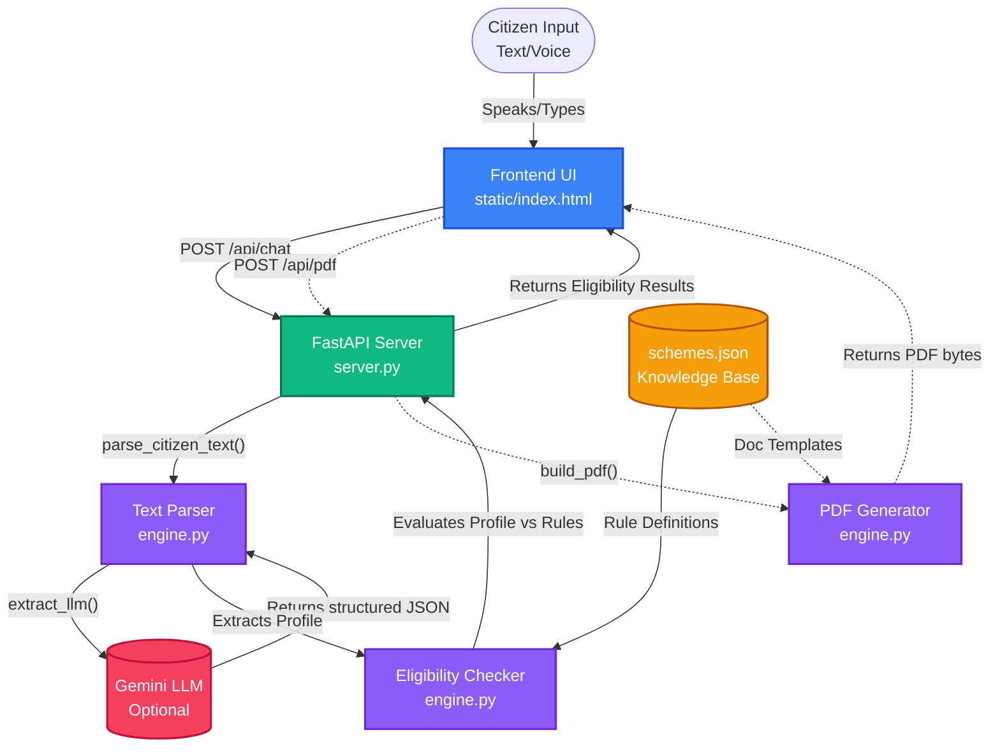

# Sarkari Sahayak - Comprehensive Documentation

Welcome to the **Sarkari Sahayak** project documentation! This guide is designed to help new contributors and developers understand the architecture, data flow, and components of the project.

---

## 1. Project Overview

**Sarkari Sahayak** is a multilingual (English, Marathi, Hindi) citizen-scheme agent. It helps citizens discover government schemes they are eligible for based on their personal profile (age, income, gender, etc.).

### Key Features:
- **Deterministic Rules Engine**: Eligibility rules and scheme details are completely separated from the AI. They are stored in `schemes.json` and evaluated deterministically, ensuring the agent never hallucinates rules or benefits.
- **Multimodal Inputs**: Citizens can describe their situation using text or voice (via browser Web Speech API).
- **LLM Integration (Optional)**: Uses an LLM (e.g., Gemini) to extract structured facts from free-form citizen text. If an API key is missing, it falls back to a robust Regex/Keyword extractor.
- **Draft PDF Generation**: Automatically generates a pre-filled draft application and a checklist of required documents in the user's preferred language.
- **MCP Support**: The core tools can be exposed to Claude Desktop or other MCP clients.

---

## 2. Architecture & Data Flow

The project is built with a clear separation of concerns. Below is a high-level flowchart of how data moves through the system when a user submits a query.



---

## 3. Core Components

### A. The Knowledge Base (`schemes.json`)
This is the heart of the deterministic engine. It contains:
- **`fields`**: The definitions of profile attributes (e.g., age, gender, income) and their possible options in 3 languages.
- **`schemes`**: The list of government schemes. Each scheme defines:
  - Basic info (name, benefit, level).
  - `rules`: Logical conditions (e.g., `age >= 18`, `gender == female`). Some rules can be `"soft": true` (needs confirmation, doesn't hard-fail).
  - `docs`: Required document IDs.
  - `apply`: Information on where/how to apply.

### B. The Engine (`engine.py`)
Contains the core business logic.
- **Rule Evaluation (`_eval_rule`)**: Recursively evaluates citizen profiles against the rules in `schemes.json`.
- **Text Parsing (`parse_citizen_text`)**: Translates unstructured user text into a structured profile dictionary. It uses local Regex first, and optionally calls the Gemini LLM for better comprehension.
- **PDF Generation (`build_pdf`)**: Uses `fpdf` and Devanagari fonts (`fonts/`) to compile a customized application draft.

### C. The API Servers
- **FastAPI (`server.py`)**: Exposes the engine via REST API (`/api/health`, `/api/chat`, `/api/pdf`) and serves the static frontend files.
- **MCP Server (`mcp_server.py`)**: Wraps the exact same `engine.TOOLS` for use with Model Context Protocol (MCP) clients like Claude Desktop.

### D. The Frontend (`static/index.html`)
A static vanilla HTML/JS/CSS frontend that handles the user interface, microphone interaction (Web Speech API), and renders the results cards and dynamic map.

---

## 4. How to Add a New Scheme

Adding a scheme requires **zero code changes**. You only need to update the `schemes.json` file.

1. Open `schemes.json`.
2. Locate the `"schemes"` array.
3. Add a new JSON object following this structure:
```json
{
  "id": "new_scheme_id",
  "level": "state",
  "name": {
    "en": "Scheme Name English",
    "mr": "योजनेचे नाव (मराठी)",
    "hi": "योजना का नाम (हिंदी)"
  },
  "short": {"en": "Short Name", "mr": "लहान नाव", "hi": "छोटा नाम"},
  "benefit": {"en": "Benefit Details", "mr": "...", "hi": "..."},
  "apply_status": "open",
  "status_note": {"en": "Any special notes", "mr": "...", "hi": "..."},
  "rules": [
    {"f": "age", "op": "gte", "v": 18, "label": {"en": "Age 18+", "mr": "...", "hi": "..."}},
    {"f": "gender", "op": "eq", "v": "female", "label": {"en": "Women only", "mr": "...", "hi": "..."}}
  ],
  "docs": ["aadhaar_card", "income_cert"],
  "apply": {
    "mode": "online",
    "where": {"en": "Official Portal", "mr": "...", "hi": "..."},
    "url": "https://example.gov.in"
  },
  "caveat": {"en": "Disclaimer text", "mr": "...", "hi": "..."},
  "sources": ["https://source-link.com"],
  "confidence": "high"
}
```

> [!TIP]
> If a rule is somewhat flexible, you can add `"soft": true` to the rule object. If the user fails a soft rule, their status becomes "maybe" instead of "not_eligible".

---

## 5. Privacy & Security
- **No Database**: User data is kept in memory only for the duration of the request.
- **No Sensitive PII**: Aadhaar numbers and bank accounts are never asked for or sent to the LLM. They are left as blank spaces on the generated PDF for the user to fill out by hand.
